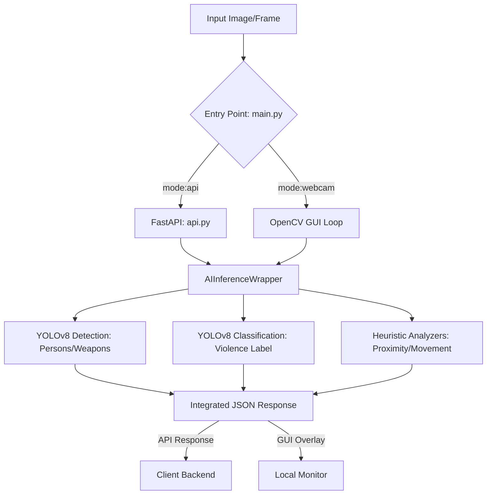

# AI Violence & Weapon Detection Microservice


A high-performance, containerized AI inference microservice designed for real-time violence and weapon detection. This project combines state-of-the-art YOLOv8 models with custom heuristic logic to provide deep situational awareness.

---

## 🚀 Execution Modes

The system supports two primary modes of operation, switchable via CLI arguments.

### 1. API Mode (Production)
Launches a FastAPI server that handles inference requests via HTTP.
```bash
python main.py --mode api --port 8000
```

### 2. Webcam Mode (Local Testing)
Runs a real-time GUI feed using your local camera or a video file.
```bash
python main.py --mode webcam --video test.mp4
```

---

## 🛠️ Installation

1. **Setup Environment**:
   ```bash
   python -m venv venv
   .\venv\Scripts\activate  # Windows
   source venv/bin/activate # Linux/macOS
   ```

2. **Install Dependencies**:
   ```bash
   pip install -r requirements.txt
   ```

---

## 📂 Example Workflow

### Scenario: Processing an Image via API
1. **Request**: A client system (e.g., CCTV backend) sends an image (File or Base64) to the microservice.
2. **Inference**: The AI service runs both Detection and Classification models in parallel.
3. **Logic**: The system calculates proximity between persons and weapons.
4. **Response**: The service returns a unified JSON containing the status, confidence, and bounding boxes.

**Sample Request (cURL):**
```bash
curl -X POST "http://localhost:8000/predict" -F "file=@scene.jpg"
```

---

## 📊 Data Flow

The following diagram illustrates how data moves through the system:



---

## 🐳 Docker Deployment

Deploy the microservice as a lightweight container in seconds.

**1. Build the image:**
```bash
docker build -t violence-detection-api .
```

**2. Run the container:**
```bash
docker run -p 8000:8000 violence-detection-api
```

---

## 📡 API Reference

### POST `/predict`
Accepts a multipart file or a JSON body with `image_base64`.

**Success Response:**
```json
{
  "prediction": "violence",
  "confidence": 0.94,
  "detections": {
    "persons": [{"x1": 102, "y1": 50, "x2": 450, "y2": 600, "conf": 0.89}],
    "weapons": [{"x1": 200, "y1": 300, "x2": 250, "y2": 350, "conf": 0.72}]
  },
  "heuristic_alerts": ["Weapon Detected near Person"],
  "processing_time_ms": 124.5
}
```

---

## ⚙️ Configuration
Modify `config/settings.py` to tune detection thresholds:
- `CONFIDENCE_THRESHOLD`: Minimum confidence for AI detections.
- `VIOLENCE_PROXIMITY_THRESHOLD`: Pixel distance to trigger alerts.

---

## 📜 Key Changes in this Version
- **Refactored Architecture**: Decoupled AI logic into `model_wrapper.py`.
- **FastAPI Migration**: Full production-ready web backend.
- **Unified Logic**: Combined classification + detection + heuristics.
- **Improved Logging**: Detailed prediction logs for auditability.
